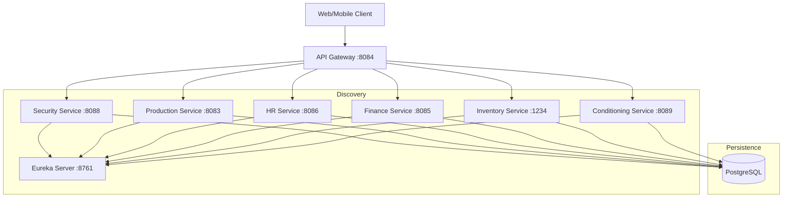

# OSM Microservices Project

A comprehensive microservice-based architecture for managing oil production, logistics, finance, and human resources.

## 🏗 System Architecture



## 📂 Project Structure
| Module | Description |
| :--- | :--- |
| **`osm-eureka`** | Service Discovery Server |
| **`osm-gateway`** | Routing & Global CORS |
| **`osm-sec`** | Auth Server (OAuth2) |
| **`osm-prod`** | Oil Production & QC |
| **`osm-pack`** | Inventory & Packaging |
| **`osm-fin`** | Finance & Transactions |
| **`osm-hr`** | HR & Payroll |
| **`osm-cond`** | Conditioning Logic |
| **`osm-ms-fe`** | Angular Frontend |
| **`osm-parent`** | Shared Libs & Base Classes |

## 🐳 Deployment (Docker Compose)
To start the entire stack locally:
```bash
docker compose up --build
```
*Note: This will automatically create all required databases.*

## ⚙️ Logging Optimizations
Logs have been tuned to be quiet by default. You can enable debug logs via environment variables:
- `LOG_LEVEL_EUREKA=DEBUG`
- `LOG_LEVEL_REST=DEBUG`

## 🔗 CI/CD
Each repository is integrated with **GitHub Actions** for automated building, Docker image pushing to **GHCR**, and deployment to the production VPS.

## Git Workspace and Submodules

This root folder is a meta repository that keeps all microservices and the frontend together with Git submodules. Each service remains an independent repository, while the root repository stores the exact commit of each submodule that belongs to the workspace.

Clone the full workspace:

```bash
git clone --recurse-submodules <workspace-repo-url>
```

If the workspace was cloned without submodules:

```bash
git submodule update --init --recursive
```

Pull the latest `pfe` branch in every service:

```bash
git submodule foreach "git checkout pfe"
git submodule foreach "git pull origin pfe"
```

Current workspace submodules:

```text
osm-parent
osm-eureka
osm-sec
osm-fin
osm-pack
osm-prod
osm-cond
osm-hr
osm-gateway
osm-ms-fe
```

After committing inside one or more service repositories, update the root repository pointer:

```bash
git status
git add <changed-service-folder>
git commit -m "Update service submodule pointers"
```

Run Maven for all backend services from the root:

```bash
./mvnw -DskipTests clean install
```
